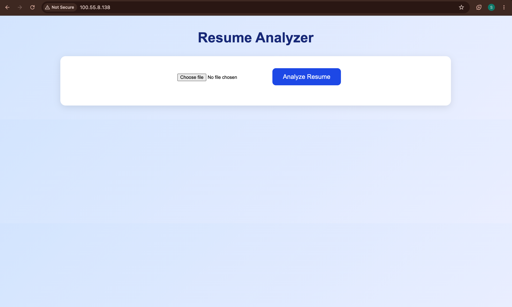
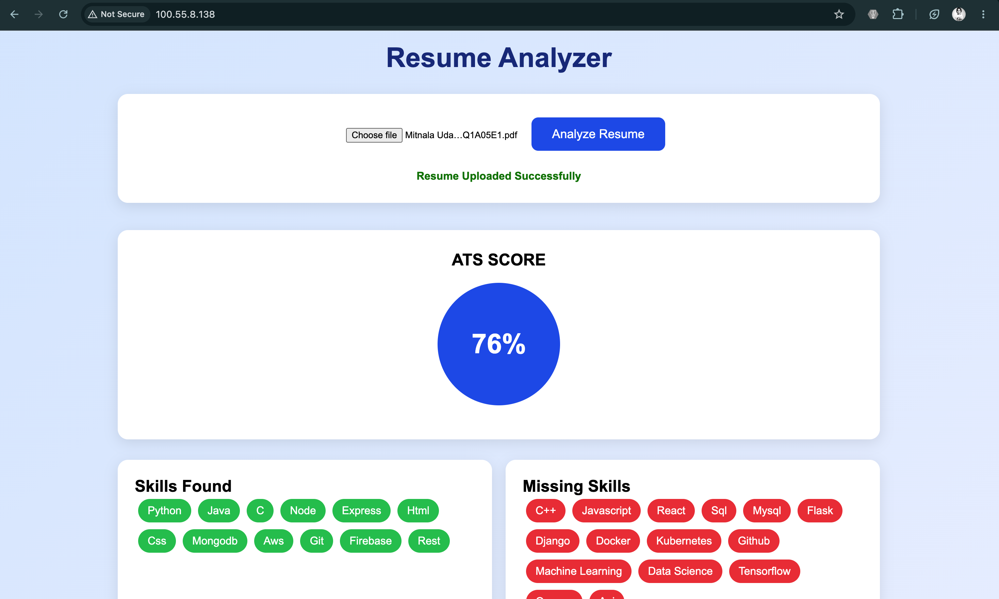
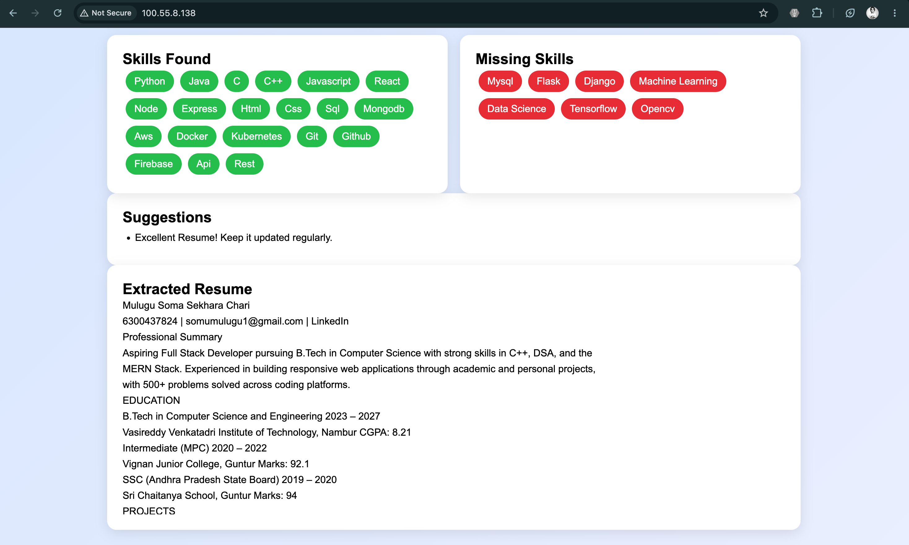
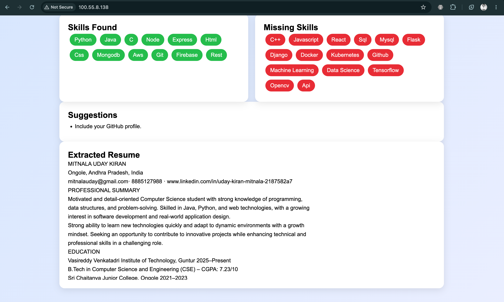

# 🚀 AI Resume Analyzer

An AI-powered Resume Analyzer that extracts text from PDF resumes, analyzes technical skills, calculates an ATS (Applicant Tracking System) score, provides improvement suggestions, and securely stores uploaded resumes in Amazon S3.

---

## 📌 Features

- 📄 Upload PDF resumes
- 🔍 Extract resume text using PDFPlumber
- 🤖 Analyze technical skills
- 📊 Calculate ATS Score
- ✅ Display detected skills
- ❌ Show missing skills
- 💡 Provide resume improvement suggestions
- ☁️ Store uploaded resumes securely in AWS S3
- 🌐 Full Stack Application deployed on AWS EC2

---

## 🛠 Tech Stack

### Frontend
- React.js
- Vite
- Axios
- CSS

### Backend
- Flask
- Python
- PDFPlumber
- Boto3
- Flask-CORS

### Cloud
- Amazon EC2
- Amazon S3
- IAM Role

---

# 📂 Project Structure

```
Resume-Analyzer/
│
├── backend/
├── frontend/
├── documentation/
│   ├── Project_Report.pdf
│   ├── Resume_Analyzer_PPT.pptx
│   └── Architecture.png
│
├── screenshots/
│   ├── home.png
│   ├── ats-score.png
│   └── result.png
│
├── README.md
├── LICENSE
├── .gitignore
└── requirements.txt
```

---

# 🏗 System Architecture

```
                User
                  │
                  ▼
        React Frontend (Vite)
                  │
          HTTP API (Axios)
                  │
                  ▼
          Flask Backend (EC2)
                  │
      ┌───────────┴───────────┐
      │                       │
      ▼                       ▼
PDFPlumber              Amazon S3
(Text Extraction)    (Resume Storage)
      │
      ▼
 Resume Analyzer
      │
      ▼
 ATS Score + Skills + Suggestions
      │
      ▼
     React UI
```

---

# ⚙️ Workflow

1. User uploads a PDF resume.
2. React frontend sends the file to the Flask backend.
3. Flask uploads the PDF to Amazon S3.
4. PDFPlumber extracts the text.
5. Resume Analyzer compares extracted text with predefined technical skills.
6. ATS score is calculated.
7. Missing skills are identified.
8. Suggestions are generated.
9. Results are returned to the frontend.

---

# 📊 ATS Score Calculation

Current ATS score is calculated using keyword matching.

Formula:

```
ATS Score =
(Number of Skills Found / Total Skills) × 100
```

---

# ☁ AWS Services Used

## Amazon EC2

- Hosts the Flask Backend
- Public IP used to access APIs

## Amazon S3

- Stores uploaded resumes securely

## IAM Role

- Grants EC2 permission to access Amazon S3
- Eliminates the need for AWS Access Keys

---

# 📷 Screenshots

## Home Page



---

## ATS Score




---

## Skill Analysis

## Skills Found



---

## Resume Extraction



---

# 🚀 Installation

## Clone Repository

```bash
git clone https://github.com/Somu0707/Resume-Analyzer.git
```

---

## Backend

```bash
cd backend

python -m venv venv

source venv/bin/activate

pip install -r requirements.txt

python app.py
```

---

## Frontend

```bash
cd frontend

npm install

npm run dev
```

---

# 🌍 Deployment

### Backend

- Amazon EC2

### Frontend

- Vite Build
- Nginx

---

# 🔮 Future Enhancements

- AI-based Resume Suggestions using LLMs
- Job Description Matching
- Resume Ranking
- Download Analysis Report
- User Authentication
- Resume History
- Dashboard
- OCR Support for Image-based Resumes
- Support for DOCX Files

---

# 📚 Learning Outcomes

Through this project, I learned:

- React.js
- Flask API Development
- REST APIs
- PDF Text Extraction
- AWS EC2 Deployment
- Amazon S3 Integration
- IAM Roles
- Axios API Communication
- Full Stack Deployment

---

# 👨‍💻 Author

**Mulugu Soma Sekhara Chari**

B.Tech Computer Science & Engineering

GitHub:
https://github.com/Somu0707

LinkedIn:
https://www.linkedin.com/in/mulugu-soma-sekhara-chari/

---

# ⭐ If you like this project

Please consider giving it a ⭐ on GitHub.